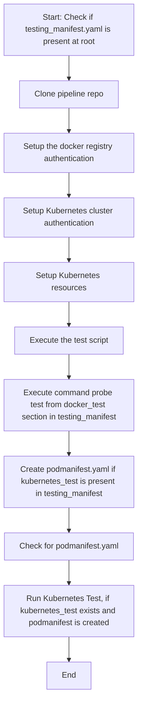

## Table of Contents

- [Functional Testing Stage Documentation](#functional-testing-stage-documentation)
  - [Overview](#overview)
  - [Workflow Diagram](#workflow-diagram)
  - [Steps and Commands](#steps-and-commands)
  - [Rules](#rules)
- [templates.sh Script Documentation](#templatessh-script-documentation)
  - [Overview](#overview-1)
  - [Detailed Explanation](#detailed-explanation)
  - [Usage](#usage)
- [test.py Script Documentation](#testpy-script-documentation)
  - [Overview](#overview-2)
  - [Detailed Explanation](#detailed-explanation-1)
  - [Usage](#usage-1)
- [Creation of podmanifest.yaml in test.py](#creation-of-podmanifestyaml-in-testpy)
  - [How it's Achieved](#how-its-achieved)
- [run_k8s_test.sh Script Documentation](#run_k8s_testssh-script-documentation)
  - [Overview](#overview-3)
  - [Detailed Explanation](#detailed-explanation-2)
  - [Usage](#usage-2)
- [testing_manifest.yaml User Documentation](#testing_manifestyaml-user-documentation)
  - [Command Probe Tests](#command-probe-tests)
  - [Kubernetes Test](#kubernetes-test)
  - [Example testing_manifest.yaml template](#example-testing_manifestyaml-template)
- [Variables set on CI/CD Vars Gitlab](#variables-set-on-cicd-vars-gitlab)
  - [Admin Level](#admin-level)
  - [Group Level](#group-level)


# Functional Testing Stage Documentation

The functional testing stage is a crucial step in the Continuous Integration/Continuous Deployment (CI/CD) process. It ensures that images, once built, function as expected. This step not only assures the functionality of the images but also helps in building trust among the users.

## Overview

In this stage, the pipeline:
1. Clones the repository.
2. Sets up authentication for the package.
3. Installs necessary dependencies. (not necessary if baked into the image and in disconnected run)
4. Views the Kubernetes configuration.
5. Sets up Kubernetes resources for functional testing.
6. Executes the main testing script.
7. Optionally runs a Kubernetes test if a specific manifest file exists.

## Workflow Diagram

Here is a flowchart representation:



## Steps and Commands

1. **Cloning the Repository**:
   ```bash
   git clone -b ${PIPELINE_REPO_BRANCH} ${PIPELINE_REPO} ${PIPELINE_REPO_DESTINATION}
   ```

2. **Listing the Contents**:
   ```bash
   ls -al ${PIPELINE_REPO_DESTINATION}
   ```

3. **Sourcing the Templates**:
   ```bash
   source ${PIPELINE_REPO_DESTINATION}/stages/functional_testing/library/templates.sh
   ```

4. **Setting up Package Authentication**:
   ```bash
   package_auth_setup
   ```

5. **Installing Dependencies**:
   ```bash
   pip3 install pyyaml
   ```

6. **Viewing Kubernetes Configuration**:
   ```bash
   kubectl config view
   ```

7. **Setting up Kubernetes Resources**:
   ```bash
   setup_k8s_resources "functional-testing" # run this as admin
   ```

8. **Changing Permissions**:
   ```bash
   chmod +x ${PIPELINE_REPO_DESTINATION}/stages/functional_testing/library/run_k8s_test.sh
   ```

9. **Executing the Main Test Script**:
   ```bash
   python3 ${PIPELINE_REPO_DESTINATION}/stages/functional_testing/library/test.py $CI_PROJECT_DIR
   ```

10. **Conditional Kubernetes Test**:
   ```bash
   if [[ -f "/tmp/podmanifest.yaml" ]]; then ${PIPELINE_REPO_DESTINATION}/stages/functional_testing/library/run_k8s_test.sh; fi
   ```

## Rules:
- The testing stage will always run if `testing_manifest.yaml` exists.
- Otherwise, the testing stage will never run.

# `templates.sh` Script Documentation

The `templates.sh` script provides environment settings and helper functions that assist in setting up debugging, Docker authentication, and Kubernetes resources.

## Overview

- **Debug Settings**: The script contains conditions that enable debugging mode if certain environment variables or conditions are met.
- **Error Handling**: Provides a mechanism to catch and display errors in a readable format.
- **Docker Authentication**: Helps in setting up Docker authentication based on environment variables.
- **Kubernetes Resources**: Contains a function to setup Kubernetes resources such as Docker registry secrets and service accounts.

## Detailed Explanation

### Debugging and Error Handling

1. The script checks if it's being run standalone. If so, it provides an informative message and exits.
2. If the `DEBUG_ENABLED` environment variable is set to `true` or if certain merge request conditions are met, the script will enable bash debugging with the `-x` option.
3. The `trap` command is used to catch errors and display an error message with the file and line number where the error occurred.

### Docker Authentication (`package_auth_setup` function)

1. This function creates a directory for Docker configuration if it doesn't exist.
2. It then uses `jq` to construct a Docker `config.json` file with authentication details for various registries, based on environment variables.

### Kubernetes Resources (`setup_k8s_resources` function)

1. **Namespace and Docker Credentials**: The function accepts a namespace argument and checks for Docker environment variables. If they're not set, it displays a message and returns.
2. **Docker Registry Secret**: If a secret named `my-registry-secret` doesn't exist in the specified namespace, it creates one using the Docker environment variables.
3. **Service Account Patching**: Checks if the default service account in the specified namespace has `my-registry-secret` as an image pull secret. If not, it patches the service account with this secret.
4. **Resource Quota**: (Commented Out) There are commented lines in the script which, if uncommented, would check for a resource quota named `my-resource-quota` in the namespace. If it doesn't exist and the namespace isn't `command-probe-testing`, it would create one.

## Usage

The script is intended to be sourced and not run directly. To use it:

```bash
source templates.sh
```

# `test.py` Script Documentation

The `test.py` script is designed to test Docker images by running them as pods in a Kubernetes environment. It performs various checks based on a testing manifest, and also ensures the Docker image is loaded and ready for testing.

## Overview

- **Color Printing Functions**: The script provides helper functions to print messages in different colors for better readability.
- **Command Execution**: Contains functions to execute shell commands and Kubernetes commands.
- **Docker Image Checks**: Functions to check if a Docker image is loaded, and if not, it tries to pull the image.
- **Pod Manifest Generation**: Generates a Kubernetes pod manifest based on the testing manifest.
- **Test Execution**: Contains the main logic to run the tests described in the testing manifest.
- **Main Execution**: The script's entry point, where it checks for the necessary arguments and initiates the testing process.

## Detailed Explanation

### Color Printing Functions

The script provides utility functions (`print_green`, `print_red`, `print_blue`, and `print_yellow`) to print messages in different colors for better clarity and differentiation.

### Command Execution

1. `pod_commmand_passes`: Executes a command on a pod and checks if its output matches the expected output.
2. `pod_completes`: Waits for a pod to reach the "Completed" status.
3. `get_pod_logs`: Retrieves the logs of a specified pod.
4. `cleanup_pod`: Deletes a specified pod from the Kubernetes cluster.

### Docker Image Checks

1. `image_loaded`: Checks if a Docker image is already loaded in the local repository.
2. `pull_docker_image`: Tries to pull a Docker image.
3. `read_image_from_hardening_manifest`: Reads the Docker image details from the hardening manifest.

### Kubernetes Manifest Generation

The `generate_pod_manifest` function generates a Kubernetes pod manifest based on the details in the testing manifest. This includes setting readiness probes, liveness probes, environment variables, resource limits, and image pull secrets.

### Test Execution

The `run_test` function is the main test execution function. It:

1. Initializes the pod with the Docker image.
2. Waits for the pod to complete.
3. Retrieves the pod logs.
4. Compares the pod logs with the expected output (if specified).

### Main Execution

The script starts its execution in the `if __name__ == "__main__":` block. Here:

1. It checks for the correct number of arguments.
2. Sets the Kubernetes namespace (default is "functional-testing").
3. Calls the `main` function to start the testing process based on the provided manifest.

## Usage

To use the script, navigate to the directory containing the script and run:

```bash
python3 test.py <git_project_root_folder>
```
# Creation of `podmanifest.yaml` in `test.py`

The `test.py` script encompasses an essential capability: the dynamic generation of a Kubernetes Pod manifest, specifically designed for the tests it's set to run. This manifest is subsequently written to `/tmp/podmanifest.yaml`.

## How it's Achieved:

### 1. **Function: `generate_pod_manifest(kubernetes_test, image_name)`**

This function crafts the foundational structure of a Kubernetes Pod manifest and then populates it according to the provided image and any Kubernetes-specific tests present in the `testing_manifest.yaml`.

- **Base Pod Manifest**:
  - A rudimentary structure for the Pod manifest is laid out with placeholders. This encompasses:
    - Pod API version and type.
    - Metadata such as name and labels.
    - A basic container specification with a placeholder for the image.

- **Customization**:
  - The function subsequently adjusts this primary manifest based on the `kubernetes_test` input:
    - If defined in the `kubernetes_test`, Readiness and Liveness Probes are incorporated.
    - If present, Environment variables (`env`) are appended.
    - Resources, such as CPU and Memory requests and limits, are stipulated either from the `kubernetes_test` or through hardcoded defaults.
    - To ensure the image can be fetched from a private registry, ImagePullSecrets is appended to the Pod spec.

- **Return**:
  - The function culminates by returning the manifest in YAML format.

### 2. **Usage in `main()` Function**:

Post the identification of the Docker image to be tested within the `main()` function, the script ascertains if there are any Kubernetes-oriented tests to be executed. If affirmative, it invokes the `generate_pod_manifest` function to craft the manifest. This manifest is then inscribed to `/tmp/podmanifest.yaml`.

```python
pod_manifest_yaml = generate_pod_manifest(kubernetes_test, docker_image)
with open("/tmp/podmanifest.yaml", "w") as file:
    file.write(pod_manifest_yaml)
```

# `run_k8s_tests.sh` Script Documentation

The `run_k8s_tests.sh` script deploys a Kubernetes pod based on a manifest file and monitors its status to ensure it runs correctly. The script is designed to validate the functionality of the container image within a Kubernetes environment.

## Overview

1. **Variables Initialization**: Setting up default namespace and unique pod name.
2. **Print Functions**: Helper functions to display messages in various colors.
3. **Script Execution**: The core logic for deploying and monitoring the pod, including error handling.
4. **Cleanup**: Deletes the deployed pod at the end.

## Detailed Explanation

### Variables Initialization

- `NAMESPACE`: The Kubernetes namespace where the pod will be deployed. Default is "functional-testing".
- `UNIQUE_POD_NAME`: A unique pod name generated using `uuidgen`.

### Print Functions

The script provides utility functions to display messages in different colors, aiding in better log differentiation:

- `print_header`: Yellow-colored header text.
- `print_green`: Green-colored text for successful operations or positive messages.
- `print_red`: Red-colored text for errors or negative messages.
- `print_blue`: Blue-colored text for general information.
- `print_yellow`: Yellow-colored text for warnings or additional info.
- `print_cyan`: Cyan-colored text, though not used in this script, available for future use.

### Script Execution

1. **Namespace Validation**: Assumes that the namespace specified by the `NAMESPACE` variable exists.
2. **Extract Image from Manifest**: Reads the image name from the `/tmp/podmanifest.yaml` file.
3. **Pod Deployment**: Modifies the pod name in the manifest and deploys the pod to the Kubernetes cluster.
4. **Pod Monitoring**: Monitors the pod's status for 3 minutes. If the pod consistently fails or runs, it breaks out of the monitoring loop early.
5. **Pod Description**: Describes the pod to fetch details about its deployment and potential issues.
6. **Fetch Pod Logs**: Retrieves the logs of the deployed pod.
7. **Error Handling**: If the pod doesn't reach the "Running" or "Completed" state, the script fetches details about the Liveness and Readiness probes, if they exist.

### Cleanup

- The deployed pod is deleted from the Kubernetes namespace.
- The script ends by checking the final status of the pod and provides an appropriate exit code.

## Usage

To execute the script, navigate to its directory and run:

```bash
./run_k8s_tests.sh
```

# `testing_manifest.yaml` User Documentation

The `testing_manifest.yaml` file plays a crucial role in the functional testing phase of our CI/CD pipeline. To activate the functional testing stage, this file should reside at the root level of each repository.

## Command Probe Tests

```yaml
docker_tests:
```

- **docker_tests**: List of tests to be executed within Docker containers.

  - **name** (Optional): 
    - Description: A descriptive name for the test.
  
  - **description** (Optional): 
    - Description: Context or a brief about the test.
  
  - **commands**: 
    - Description: List of commands to be executed within the container.
      - **command** (Required): 
        - Description: The actual command to run.
      - **expected_output** (Optional): 
        - Description: The expected output of the command.
      - **timeout_seconds** (Optional, Default: 30 seconds): 
        - Description: Time duration before the command is considered timed out.

## Kubernetes Test

```yaml
kubernetes_test:
```

- **env** (Optional): 
  - Description: Environment variables for the container. 
    - **name**: Name of the variable.
    - **value**: Value for the variable.

- **livenessProbe** (Optional): 
  - Description: Specifies the container's health check.
    - Various fields based on Kubernetes liveness probes.

- **readinessProbe** (Optional): 
  - Description: Specifies when the container is ready to serve requests.
    - Various fields based on Kubernetes readiness probes.

- **resources** (Optional): 
  - Description: Resource requests and limits for the container.
    - **requests**: 
      - **memory**: Memory request (e.g., "64Mi").
      - **cpu**: CPU request (e.g., "250m").
    - **limits**: 
      - **memory**: Memory limit (e.g., "128Mi").
      - **cpu**: CPU limit (e.g., "500m").

## Example testing_manifest.yaml template
```yaml
docker_tests:
  - name: Descriptive name for this test #Optional field
    description: Description for the test #Optional field
    commands: 
      - command: command to run within the container #Required field
        expected_output: what is the expected stdout of the command above #Optional field
        timeout_seconds: How long a command should take in seconds #Optional field if not set the default value is 30 seconds
      - command: second command to run within the same  container #Optional
        expected_output: expected output of the second command #Optional
        timeout_seconds: How long a command should take in seconds #Optional field if not set the default value is 30 seconds
# Can have multiple commands.
  - name: Descriptive name for this second test#Optional field
    description: Description for the test #Optional field
    commands: 
      - command: command to run within the container #Required field
        expected_output: what is the expected stdout of the command above #Optional field
        timeout_seconds: How long a command should take in seconds #Optional field if not set the default value is 30 seconds
      - command: second command to run within the same  container #Optional
        expected_output: expected output of the second command #Optional
        timeout_seconds: How long a command should take in seconds #Optional field if not set the default value is 30 seconds

kubernetes_test:
  # Optional - will follow the spec of env from podSpec. Need to be relevant for the image being tested
  env: 
    - name: TEST
      value: "test"
    - name: ANOTHERTEST
      value: "anothertest"
    - name: CLUSTER
      value: "epona"
  # Optional - will follow the spec of livenessProbe from podSpec. Need to be relevant for the image being tested
  livenessProbe:
    tcpSocket:
      port: 5432
    initialDelaySeconds: 30
    periodSeconds: 10
  # Optional - will follow the spec of readinessProbe from podSpec. Need to be relevant for the image being tested
  readinessProbe:
    exec:
      command:
      - sh
      - -c
      - exec pg_isready --host=localhost
    initialDelaySeconds: 5
    timeoutSeconds: 1
    periodSeconds: 5
    failureThreshold: 3
  # Optional - will follow the spec of resources from podSpec. Need to be relevant for the image being tested. If this is not set, the default value for the resource spec will be set. Cannot be more than 2Gi memory and 1 CPU
  resources:
    requests:
      memory: "64Mi"
      cpu: "250m"
    limits:
      memory: "128Mi"
      cpu: "500m"

```
# Variables set on CI/CD Vars Gitlab
The variables are set in admin and group level for the pipline to function properly. Depending on the variable some are protected and hidden so that they will not show up in the logs and can only be used by the protected branch
## Admin Level
```bash 
BB_REGISTRY_AUTH: "Registry authentication in base64 for BB Registry (registry.dso.mil)"
DOCKER_AUTH: "Registry authentication in base64 for docker.io"
DOCKER_AUTH_CONFIG: "Docker auth json to pull the builder image from registry1"
DOCKER_PASSWORD: "Password for the Docker registry so that k8s can pull the image from this private registry"
DOCKER_REGISTRY_SERVER: "Registry server url for the private docker registry"
DOCKER_USER: "Service user for the private docker registry"
IL2_REGISTRY_AUTH: "Registry authentication in base64 for registry.il2"
REGISTRY1_AUTH: "Registry authentication in base64 for registry1"
```
## Group Level
```bash 
PIPELINE_REPO: "Pipeline repository url"
PIPELINE_REPO_BRANCH: "Branch to pull from pipeline repository"
PIPLINE_REPO_DESTINATION: "Destination to clone the pipeline repo into during build time"
```