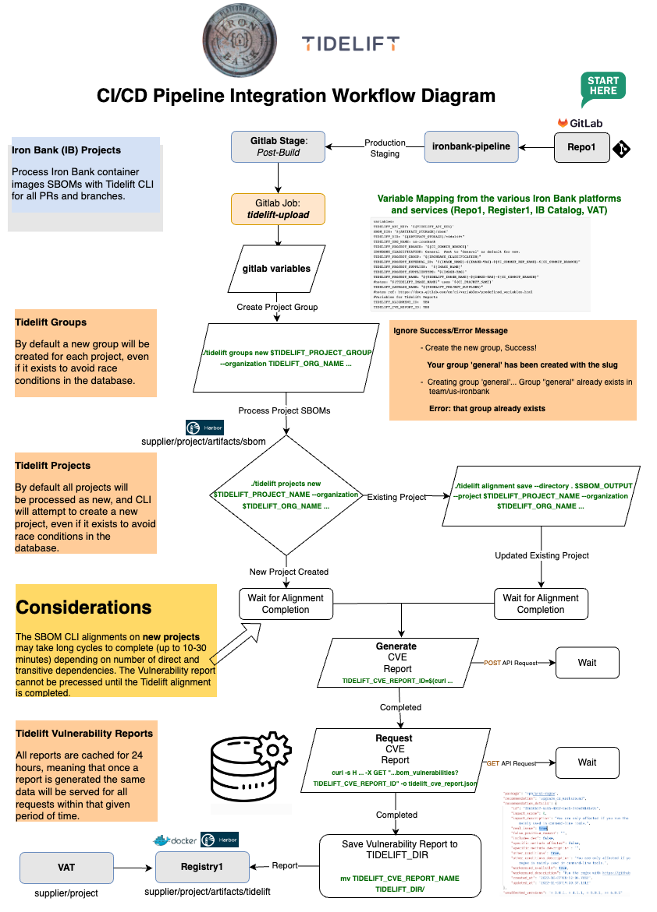
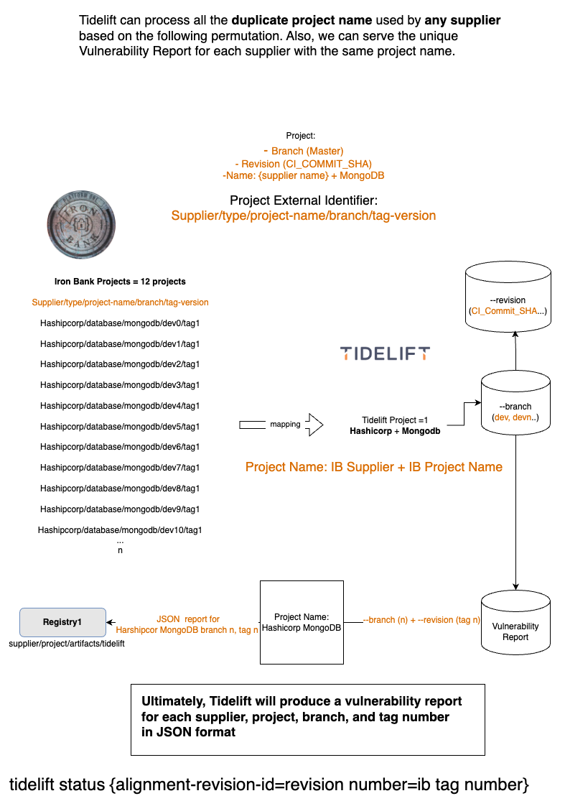
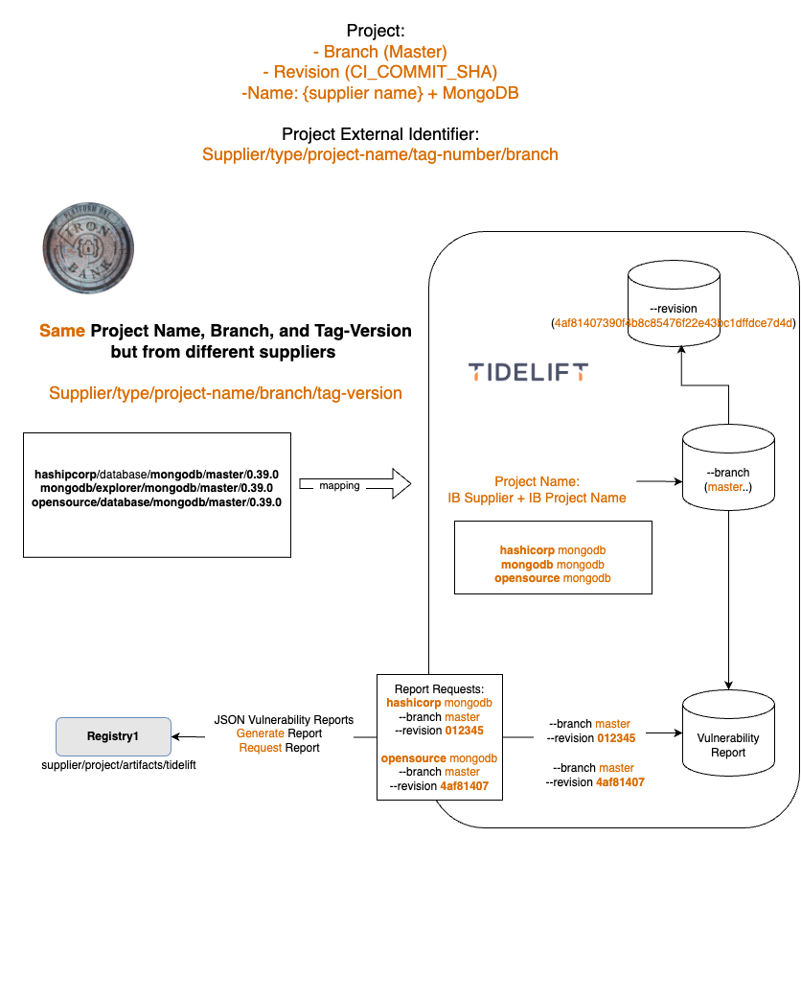

# Tidelift Iron Bank CI/CD Pipeline Integration Objective 


## CI/CD Integration Description
Iron Bank is the DoD's source for hardened containers. A hardened container allows the application/container to run on an ATO'd Kubernetes cluster that meets the DevSecOps Reference Design. 

**Continuous Accreditation of Hardened Images | High-Level CI/CD Pipeline Workflow**


Source: [https://p1.dso.mil/IBVS_pipeline.e027a745.webp](https://p1.dso.mil/IBVS_pipeline.e027a745.webp)

The CI/CD Pipeline Workflow high-level stages:

1. Initialization 
2. Antivirus Scan
3. Build
	* 3.5. Post-Build
4. Scanning
5. Check CVEs
6. Publish (Registry 1)

Containers submitted to Iron Bank will be scanned and evaluated according to **Iron Bank Acceptance Baseline Criteria (ABC)** and judged complaint or non-compliant. Each container will also receive an **Overall Risk Assement (ORA) score**.

## Objective 
Tidelift will integrate in the existing Iron Bank CI/CD Pipeline Workflow following the **Build Stage** of the container hardening proces described above. More specifically during `post-build` stage composed of two major jobs: 1) `create-sbom` job which generates the SBOM artifacts and 2) `tidelift-upload` job that will use the Tidelift CLI binary to authenticate and upload the container image SBOM (Cyclonedx and/or SPDX) file into the Tidelift SaaS.
After completing the SBOM upload (Tidelift alignment), a Vulnerability report will be generated and requested from Tidelift to be uploaded into the Iron Bank Registry 1 services.  


All Gitlab errors during the Tidelift SBOM upload and API vulnerability report request will be logged, but the Gitlab pipeline will continue to run and execute the subsequent stages and jobs in the IB CI/CD workflow process. One key concern to address will be the `tidelift-upload` job time to completion, which may delay the subsequent stages and jobs in the pipeline.  
 
Once the conctainer image SBOM is processed by Tidelift, the Iron Bank teams (VAT, CHT Cybersecurity, and Pop-team) will be able to use the Tidelift APIs to capture open source library components/package data intelligence related to the Security, Mantenance, Licensing, Software Development Best Practices/Standards (NIST SSDF, and Linux Foundation OpenSSF Scorecard Checks). 


#Iron Bank Varibale Mapping from Repo1, Registry1, IB Catalog, and VAT
A project naming convention has been established with Iron Bank and Tidelift for project referencing and alignment. The Iron Bank catalog services such as Repo1, Registry1, IB Catalog, and VAT, all have different information architecture for the projects. As a result, to normalize the supplier name, project type (group), project name, branch name, with Iron Bank and Tidelift have agreed on the following mapping:

* Tidelift Catalog Name: by Supplier Name (ie. Red Hat)
* Tidelift Project Name: SupplerName-project-name 
* Tidelift External Prj Identifier: SupplierName/SubGroup/projectname/tagnumber/
* Tidelift Project Revision: Unique Identifier - recommendation 
``${CI_COMMIT_SHA}:${CI_JOB_ID}:$(date --iso-8601=minutes) ==> {CI_JOB_ID}``
* Tidelift Default branch: gitlab project branch name
* Tidelift Group: Iron Bank Core, default to "general"

### Gitlab Variables 

```
variables:
    TIDELIFT_API_KEY: "${TIDELIFT_API_KEY}"
    SBOM_DIR: "${ARTIFACT_STORAGE}/sbom" 
    TIDELIFT_DIR: "${ARTIFACT_STORAGE}/tidelift"
    TIDELIFT_ORG_NAME: us-ironbank
    TIDELIFT_PROJECT_BRANCH: "${CI_COMMIT_BRANCH}"
    #set IB Tier Group to "General" as default for now. 
    IRONBANK_CLASSIFICATION: General  
    TIDELIFT_PROJECT_GROUP: "${IRONBANK_CLASSIFICATION}" 
    IRONBANK_IMAGE_NAME: "${IMAGE_NAME}"
    TIDELIFT_PROJECT_TAG: "${IMAGE_VERSION}"
    #TIDELIFT_PROJECT_REVISION: "${CI_COMMIT_SHA}"
    TIDELIFT_PROJECT_REVISION: ""
    TIDELIFT_PROJECT_NAME: ""  
    TIDELIFT_PROJECT_EXTERNAL_ID: ""
    TIDELIFT_CATALOG: "ibtest"
    TIDELIFT_PROJECT_SUPPLIER: ""
    TIDELIFT_PROJECT_SUPPLIER_TYPE: ""
```


#Iron Bank Staging Pipeline Environment 
To test the CI/CD gitlab integration script, Iron Bank is providing access to the Zelda Staging pipeline envornment. 

###Zelda Staging 
[https://code-ib-zelda.staging.dso.mil/ironbank-tools/ironbank-pipeline](https://code-ib-zelda.staging.dso.mil/ironbank-tools/ironbank-pipeline)

Proper credentials have to be granted from the IB Pops team to access the **Zelda Staging CI/CD pipeline** environment. A standard DoD Common Access Card (CAC) can be used for authentication. However, Iron Bank does have an alternative approach for access without a CAC with a third-party Appgate SDP desktop client. Tidelif is able to read and write to the ironbank-pipleine in Repo1  using the Appgate SDK and [https://login.dso.mil](https://login.dso.mil) credentials to commit code into the ironbank-pipeline repository. 

The Tidelift integration point is through the `post-build` stage, where a the`tidelift-upload` job has been created to upload the project SBOMs into Tidelift SaaS. The job will handle the Tidelift and IB gitlab environment mapping for each project and group classification using the Tidelift CLI. The Tidelift CLI SBOM alignment will process the CyclonedX SBOM first; SPDX and other formats will be included after a full production integration is completed. 

Tidelift CLI Docs
[https://support.tidelift.com/hc/en-us/articles/4406293613588-Tidelift-CLI-reference#tidelift-cli-reference-0-0](https://support.tidelift.com/hc/en-us/articles/4406293613588-Tidelift-CLI-reference#tidelift-cli-reference-0-0)

Once the Tiedelift CLI SBOM alignment is completed for each project, branch, tag, git commit, a Vulnerability report will be generated by the CLI `alignment save --json --wait`, the response from the CLI will be saved to JSON file (``cve_report.json``) that will be saved in the respective Iron Bank container image artifacts folder within registry1, path ```TIDELIFT_DIR: "${ARTIFACT_STORAGE}/tidelift"`.


Alternatively, the Tidelift APIs bom_vulnerability report could be requested for the specific project (not yet available). 
Tidelift Reports API Docs
[https://api.tidelift.com/docs/#tag/Reports](https://api.tidelift.com/docs/#tag/Reports)

For a complete Tidelift `ironbank-pipleine` network architecture integration workflow and the `tidelift-upload` gitlab job see below.  

 
 
 
 
 

### CI Gitlab Pipeline Container Image Details 
`NAME="Red Hat Enterprise Linux"
VERSION="9.3 (Plow)"
ID="rhel"
ID_LIKE="fedora"
VERSION_ID="9.3"
PLATFORM_ID="platform:el9"
PRETTY_NAME="Red Hat Enterprise Linux 9.3 (Plow)"
ANSI_COLOR="0;31"
LOGO="fedora-logo-icon"
CPE_NAME="cpe:/o:redhat:enterprise_linux:9::baseos"
HOME_URL="https://www.redhat.com/"
DOCUMENTATION_URL="https://access.redhat.com/documentation/en-us/red_hat_enterprise_linux/9"
BUG_REPORT_URL="https://bugzilla.redhat.com/"
REDHAT_BUGZILLA_PRODUCT="Red Hat Enterprise Linux 9"
REDHAT_BUGZILLA_PRODUCT_VERSION=9.3
REDHAT_SUPPORT_PRODUCT="Red Hat Enterprise Linux"
REDHAT_SUPPORT_PRODUCT_VERSION="9.3"
`